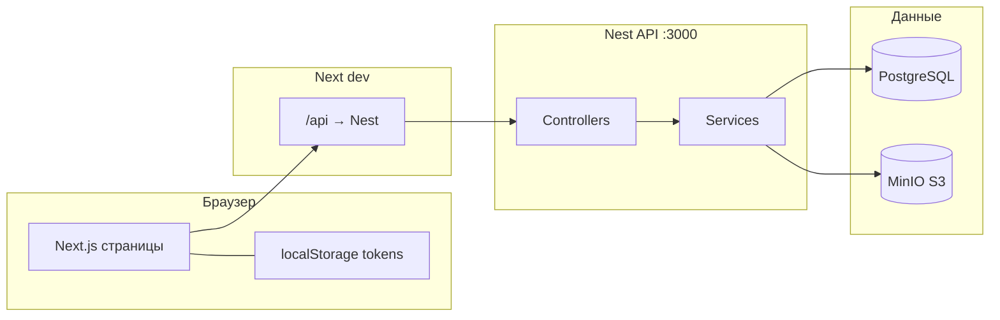

# Карта кодовой базы ES (Escort Platform)

Документ описывает **архитектуру**, **куда уходят данные** и **роль основных модулей**. Деталь по каждому методу — в Swagger (`/api/docs`) и в исходниках контроллеров.

---

## 1. Монорепозиторий

| Путь | Назначение |
|------|------------|
| `apps/api` | NestJS HTTP API, порт **3000** |
| `apps/web` | Next.js 15 (App Router), порт **3001** |
| `packages/db` | Схема Drizzle + типы таблиц PostgreSQL |
| `init-scripts/` | SQL при первом старте Postgres (Docker) |
| `docker-compose.dev.yml` | Postgres, Redis, MinIO, Mailhog |

Связка **браузер ↔ API** в dev: запросы с фронта на `http://localhost:3001/api/...` проксируются Next на `http://127.0.0.1:3000/...` (см. `apps/web/next.config.js` и `apps/web/lib/api-url.ts`).

---

## 2. Поток данных (упрощённо)

- **JWT**: после логина токены в `localStorage`; `authFetch` в `api-client.ts` подставляет `Authorization: Bearer ...`. При 401 — попытка refresh, иначе редирект на `/login`.
- **Публичные страницы** (`/models`, профиль по slug): часто `fetch(apiUrl(...))` **без** токена к тем же маршрутам Nest, которые разрешены без guard.

---

## 3. Backend (`apps/api`)

### Точка входа: `src/main.ts`

1. Валидация `process.env` через `validateEnv` (`config/validation.schema.ts`).
2. Создание приложения из `AppModule`.
3. Глобальный фильтр ошибок → JSON клиенту.
4. **Helmet** — заголовки безопасности.
5. **CORS** — список origin из `FRONTEND_URL` + `ALLOWED_ORIGINS`.
6. **ValidationPipe** — DTO/class-validator на входе.
7. **Swagger** — `/api/docs`.
8. Слушает `PORT` (по умолчанию 3000).

Данные **отправляются клиенту** как JSON ответы HTTP. Ошибки проходят через `GlobalExceptionFilter`.

### Корень модулей: `src/app.module.ts`

- Подключает `ConfigModule` с **`envFilePath: '../../.env'`** (корень монорепо относительно скомпилированного каталога — при локальном запуске из `apps/api` обычно кладут `.env` в корень репо или в `apps/api`).
- Импортирует доменные модули (ниже).

### База: `src/database/database.module.ts`

- Провайдер **`DRIZZLE`**: клиент `postgres` + `drizzle-orm` со схемой из `@escort/db`.
- Инжектится в сервисы как `@Inject('DRIZZLE') private readonly db`.
- **Куда данные**: все SQL-запросы идут в **PostgreSQL** по `DATABASE_URL`.

### Доменные модули (маршруты → хранилище)

Ниже «куда отправляет» = куда пишет/читает сервис.

| Модуль | Контроллер (префикс) | Назначение | Данные |
|--------|----------------------|------------|--------|
| **Health** | `/`, `/health` | Проверка живости | Нет БД обязательно |
| **Auth** | `/auth` | register, login, refresh, logout, me | Таблицы users, sessions |
| **Users** | `/users` | Пользователи (админка) | users |
| **Models** | `/models` | Каталог, CRUD анкет, `GET /models/my`, slug/id | model_profiles |
| **Clients** | `/clients` | Клиентские профили CRM | client_profiles |
| **Bookings** | `/bookings` | Жизненный цикл брони | bookings, audit |
| **Escrow** | `/escrow` | Платёжные транзакции (MVP) | escrow_transactions |
| **Reviews** | `/reviews` | Отзывы | reviews |
| **Blacklist** | `/blacklist` | Чёрный список | blacklists |
| **Media** | `/media` / связанные пути | Метаданные файлов (по развитию модуля) | media_files |
| **Profiles** | `/profiles` | Профили + **presigned URL**, confirm upload, медиа модели | media + MinIO |

**Profiles + MinIO**: клиент получает URL для **прямой загрузки** в MinIO; после загрузки — **confirm** в API, запись в БД. Данные файлов в Postgres не хранятся (ключ/url).

### Защита

- `JwtAuthGuard`, `RolesGuard` в `auth/guards/`.
- На части маршрутов guards отключены в dev (см. комментарии в контроллерах) — **не для продакшена**.

---

## 4. Схема БД (`packages/db/src/schema`)

Общий экспорт в `schema/index.ts`. Основные сущности:

- `users`, `sessions`
- `model_profiles`, `client_profiles`
- `bookings`, `escrow_transactions`, `reviews`, `blacklists`
- `media_files`, `audit` (если включено)

Связи — в `relations.ts`. Миграции/Studio — скрипты turbo в корневом `package.json` (`db:*`).

---

## 5. Frontend (`apps/web`)

### `app/layout.tsx`

Корневой HTML: шрифты Google, **`AuthProvider`** оборачивает всё приложение → контекст пользователя из `localStorage`.

### `components/AuthProvider.tsx`

- При монтировании читает `accessToken`, `user` из **localStorage** (данные **ни куда не отправляются**, только локально).
- `login()` — сохраняет токены и объект пользователя после успешного ответа `/auth/login`.
- `logout()` — чистит storage и редирект.
- Дочерние компоненты используют `useAuth()` для ролей (`isAdmin`, `isManager`).

### `lib/api-url.ts`

Формирует базовый URL для `fetch`:

- В **development в браузере** — относительный **`/api/...`** (прокси Next).
- На сервере SSR — прямой URL к Nest или из `NEXT_PUBLIC_API_URL`.

### `lib/api-client.ts`

Единая обёртка над `fetch`:

- Публичные методы: каталог, профиль, **createProfile**, медиа (presigned, upload, confirm), **getMyModels** → `/models/my` с JWT.
- **Куда уходят данные**: HTTP на Nest (через прокси или напрямую в prod). Тело запросов — JSON, файлы — PUT на presigned URL в MinIO.

### Маршруты `app/`

- `login`, `admin-login` — формы → вызов API auth → `AuthProvider.login`.
- `dashboard/*` — CMS моделей, часть под `ProtectedRoute`.
- `models` — публичный каталог и `[slug]` — `fetch` к публичным GET Nest.

### `public/`

Статика (favicon, `platform-blueprint.html` и т.д.) — **без** участия API.

---

## 6. Скрипты и утилиты API

`apps/api/src/scripts/*` — разовые задачи (сид админа, моделей, фото). Запуск вручную через `npx ts-node ...`. **Не** поднимаются с сервером.

---

## 7. Что этот документ не заменяет

- Построчные комментарии в каждом файле — смотрите типы DTO и сигнатуры в контроллерах.
- Актуальный список эндпоинтов — **Swagger**.
- Продуктовый бэклог — `COMPREHENSIVE_AUDIT_AND_PLAN.md` в корне репо.

---

*Обновляйте этот файл при крупных изменениях маршрутов или инфраструктуры.*
